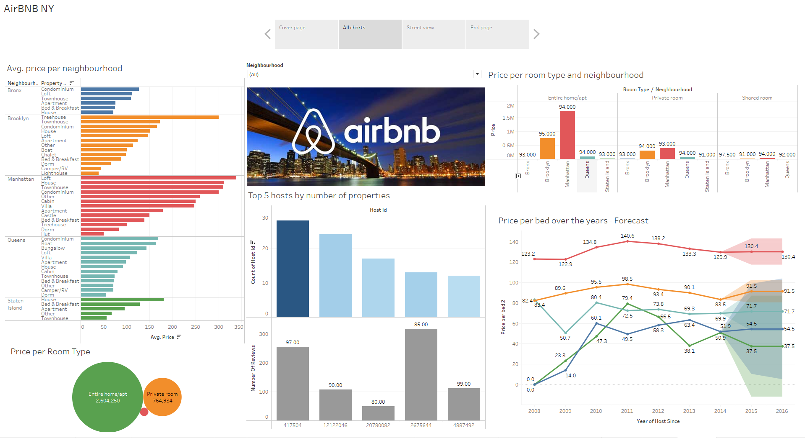
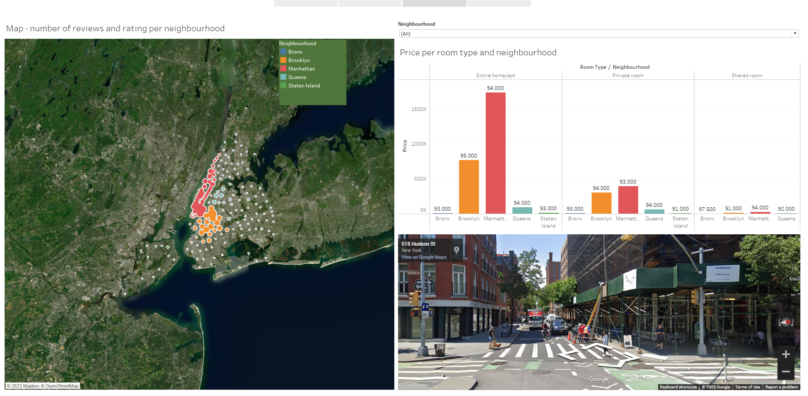

# Final-Project-Tableau

## Project/Goals
For the project I chose option 2 (Create on your own question and dashboard) for AIRBNB data.
The main goal of this project is to visualize the AIRBNB company's data in order to gain a better insight into the data and the price movement of the NYC neighborhoods.

## Process
### Step 1. Data cleaning
in file  **EDA_airbnb.ipynb**

### Step 2. Connect data **data_airbnb.xlsx** with Tableau, Detect different data types in data, bild different visualizations, bild deashbords and story. 
In file **Project3_Tableau_Airbnb.twb**

## Results
For the project, I chose option 2 (Create on your own question and dashboard) for AIRBNB data because it seemed the most interesting to me.
The questions I tried to answer through visualization in Tableau are:

1. What is the average price of a property type per neighborhood?

2. Which type of room earns the most?

3. Who are the top 5 hosts, who earns the most, what is their rating and how many reviews do they have?

4. Which type of rooms have the highest prices in which neighborhood and what is their average rating?

5. What will the average price be next year in which neighborhood?

6. Which zipcode in which neighborhood had the highest rating?

Dashboards:

## Challenges 
There were not many challenges in this project. If I'm going to name something as a challenge, it would be to set the option by selecting the street view display on the map.

## Future Goals
If I had more time, I would like to find more recent data so that I could work with the real data of the current market.
